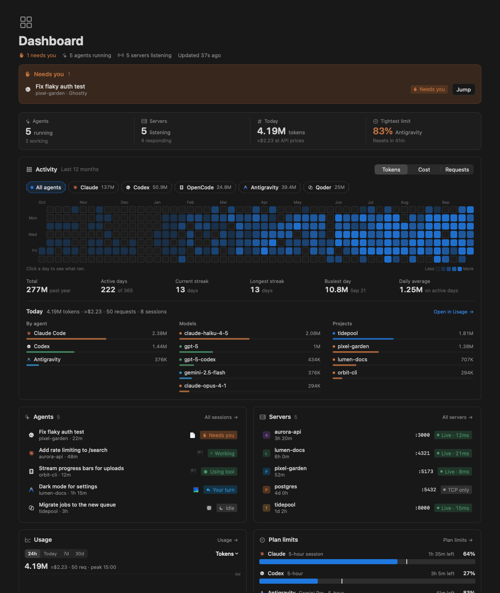
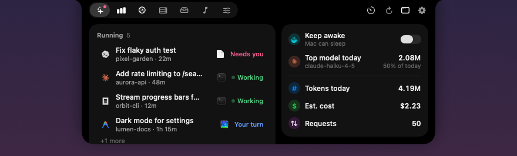
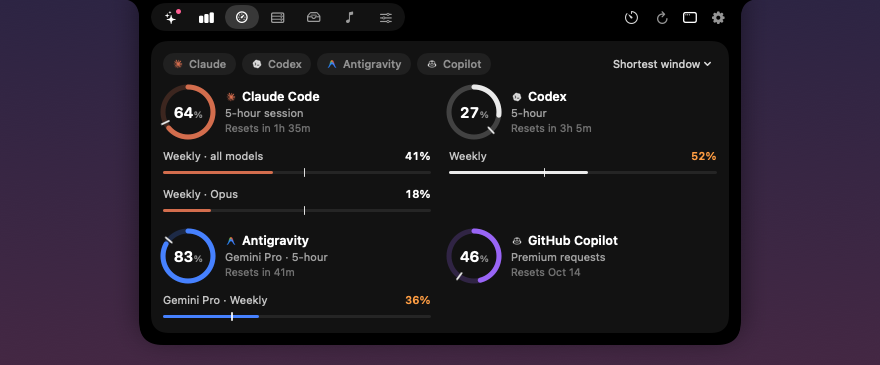
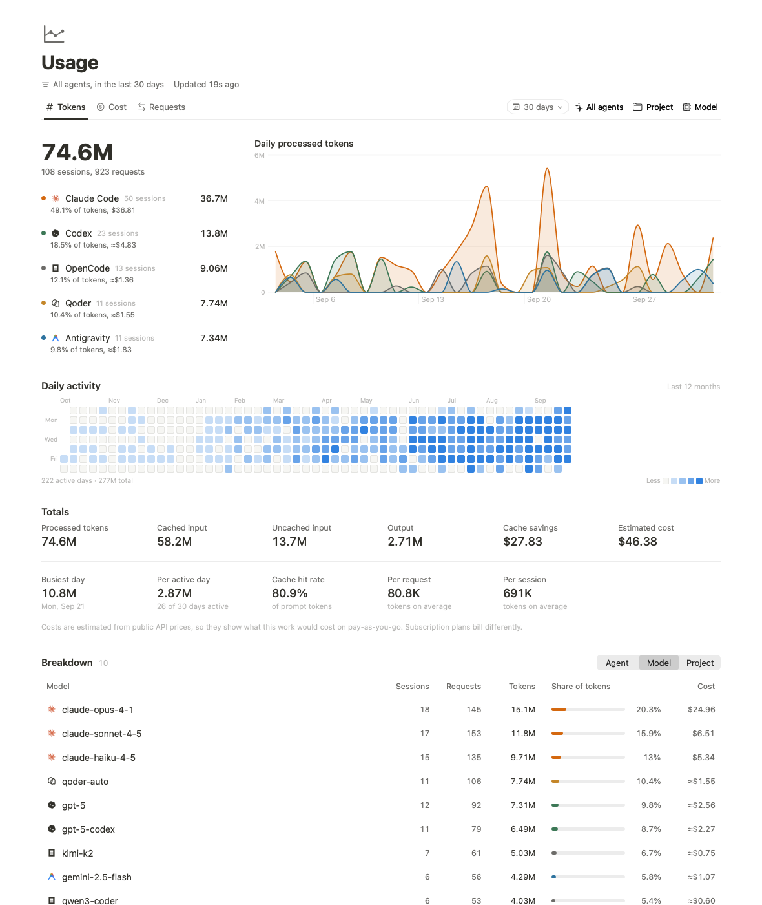
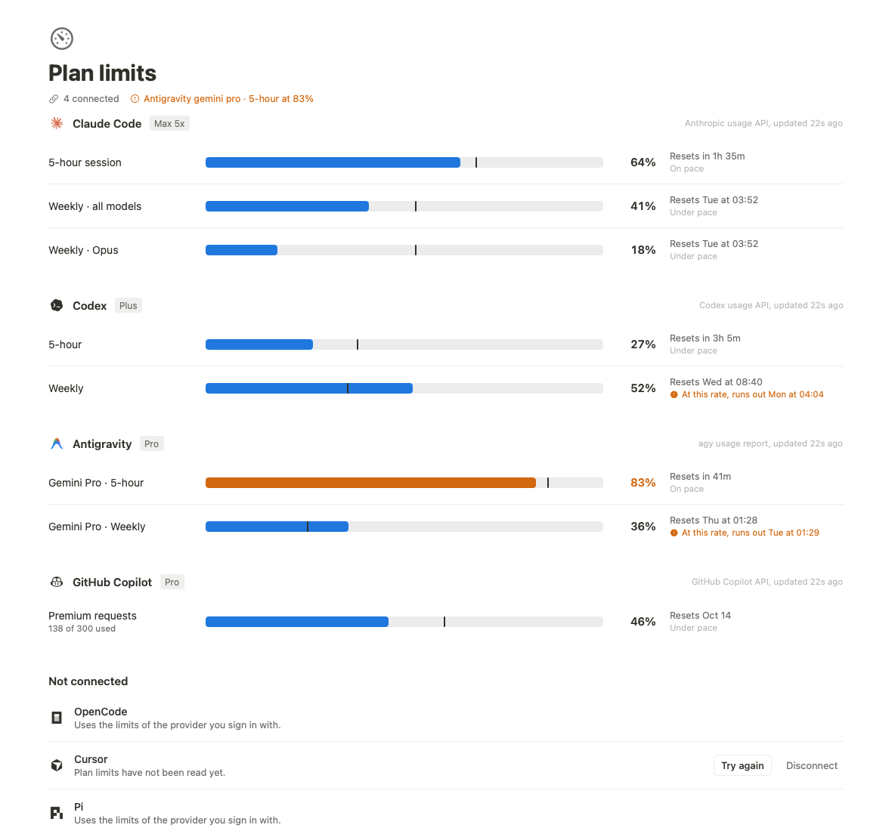
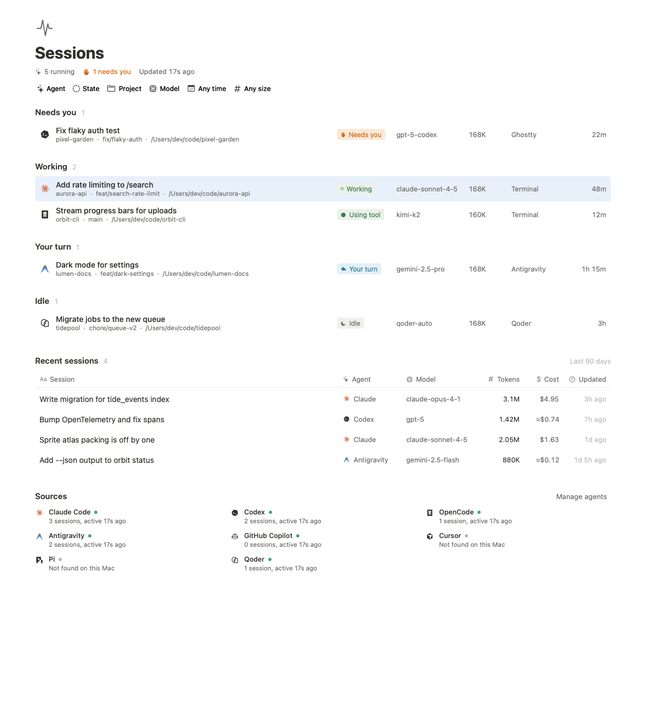
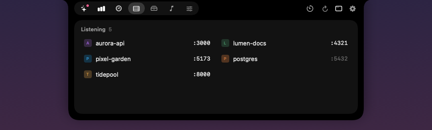
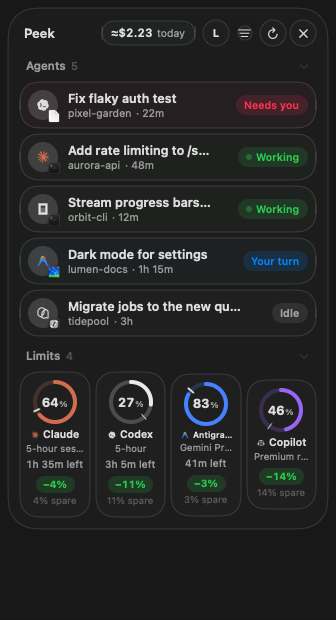
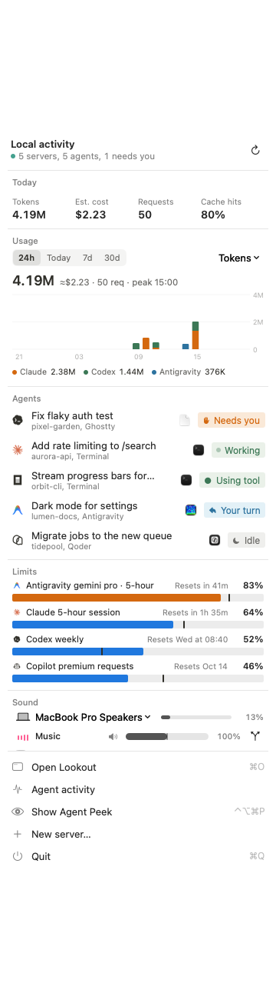
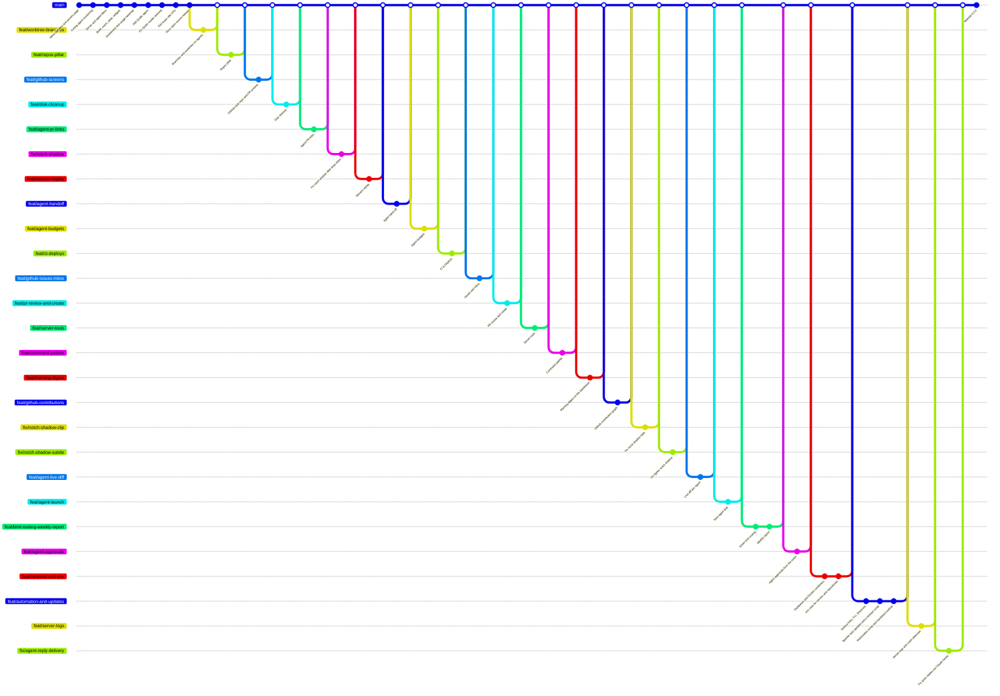

<p align="center">
  
</p>

<h1 align="center">Lookout</h1>

<p align="center">
  A native macOS command center for your coding agents and local dev servers.<br>
  See what every agent is doing, what it costs, how close you are to your plan limits, and what's listening on your ports, all from the notch.
</p>

<p align="center">
  <a href="https://github.com/ken-code-wq/lookout/releases/latest"><b>Download</b></a> ·
  <a href="#features">Features</a> ·
  <a href="#build-from-source">Build from source</a> ·
  <a href="#privacy">Privacy</a>
</p>

<p align="center">
  
</p>

## Why

If you run Claude Code, Codex, Cursor and friends side by side, you end up alt-tabbing between terminals to see which agent is waiting on you, guessing how much of your 5-hour window is left, and running `lsof` to find what's on port 3000. Lookout watches all of it locally and puts the answer one glance away.

## Features

**Coding agents**
- Live sessions across **Claude Code, Codex, OpenCode, Antigravity, GitHub Copilot, Cursor, Pi and Qoder**, with state: *Working*, *Needs you*, *Your turn*, *Idle*
- Notifications when an agent needs approval or finishes its turn, and a jump straight to its terminal or editor
- Optional live hooks: answer Claude Code's permission prompts (Allow, Deny, Always allow) from the notch, Peek or the menu bar, and send a quick reply to a session's terminal when it's your turn
- Token usage, request counts and estimated API cost per agent, model and project
- A GitHub-style 12-month activity heatmap, streaks and daily breakdowns
- Plan limits (5-hour sessions, weekly windows, premium requests) with reset times and pace

**Local servers**
- Every listening TCP port with its process, project and working directory
- HTTP health probes with status, latency and page title
- Start, stop and relaunch dev servers; saved launchers survive restarts

**Repos, GitHub and your machine**
- Local repositories with branches, worktrees and pull requests, plus GitHub issues, CI runs, deployments and a contribution graph
- Agent hand-off (push, pull request, worktree cleanup), live diffs and step-by-step session replay
- Databases and Docker containers, `.env` files, server logs with crash detection, and a Disk page that clears build artifacts and caches
- Per-agent spending budgets, smart limit routing, a morning digest and a shareable weekly report
- A ⌘K command palette, plus a `lookout` CLI and `lookout://` links

**Everywhere on your Mac**
- **Notch**: agents, usage, limits, servers, now playing, per-app sound, a shelf for files and clipboard history, a focus timer and keep-awake
- **Peek**: a small floating panel that follows you across Spaces
- **Menu bar** panel and **desktop widgets**

## Screenshots

<table>
  <tr>
    <td></td>
    <td></td>
  </tr>
  <tr>
    <td></td>
    <td></td>
  </tr>
  <tr>
    <td></td>
    <td></td>
  </tr>
  <tr>
    <td align="center"></td>
    <td align="center"></td>
  </tr>
</table>

<sub>Screenshots use generated demo data.</sub>

## Install

1. Download `Lookout.zip` from the [latest release](https://github.com/ken-code-wq/lookout/releases/latest) and unzip it.
2. Move `Lookout.app` to `/Applications`.
3. Check the release notes: releases marked **notarized** open normally, and you can skip this step. For builds that aren't notarized by Apple, macOS will block the first launch. Clear the quarantine flag once:

   ```bash
   xattr -dr com.apple.quarantine /Applications/Lookout.app
   ```

   or right-click the app › **Open** › **Open**.

Requires macOS 14.2 or later on Apple Silicon.

Desktop widgets need a build signed with a real certificate, so they won't appear in a prebuilt release that isn't notarized. Build from source to use them.

Releases with update signing turned on keep themselves current through Sparkle: **Lookout › Check for Updates…**, with automatic checks in Settings › General.

## Automation

Lookout can be driven from scripts, [Raycast](https://www.raycast.com) and Shortcuts.

**Command-line tool.** Settings › Automation › **Install command-line tool** links `lookout` into `/usr/local/bin` (or `~/.local/bin` when that isn't writable, and tells you which).

```bash
lookout status --json          # agents, plan limits, servers and today's usage
lookout agents                 # running sessions and their state
lookout limits                 # every plan-limit window and what's left
lookout open usage             # dashboard, sessions, usage, limits, repos, servers, launchers…
lookout launcher start web     # start, stop or toggle a saved launcher by name
lookout timer 25               # focus timer; `lookout awake toggle` for keep-awake
```

It reads the snapshot Lookout already writes for its desktop widgets, so it's instant and never scans anything itself. Actions go to the app through `lookout://` links.

**Links.** `lookout://open/<page>`, `lookout://launcher/<name>/start|stop|toggle`, `lookout://palette`, `lookout://new-task`, `lookout://weekly-report`, `lookout://keep-awake/on|off|toggle`, `lookout://timer/start/<minutes>`, `lookout://timer/stop`, `lookout://refresh`. Open them from anywhere: `open lookout://open/limits`.

**Raycast.** Make a [script command](https://github.com/raycast/script-commands) that runs `lookout limits` (with `@raycast.mode fullOutput`) or `lookout launcher toggle web` (`@raycast.mode silent`).

**Shortcuts.** Use a **Run Shell Script** action with `lookout status --json` and parse it with **Get Dictionary from Input**, or an **Open URLs** action with a `lookout://` link. Builds packaged with Xcode installed also expose native Shortcuts actions (agents needing attention, plan limit left, launchers, pages, keep-awake, focus timer); Settings › Automation says whether yours has them.

## Build from source

Only the Xcode Command Line Tools are needed.

```bash
git clone https://github.com/ken-code-wq/lookout.git
cd lookout
swift run LocalObserver            # run a debug build
./packaging/build-app.sh           # build Lookout.app (release)
swift run LocalObserverVerification  # parsing and core checks
```

For widgets and stable privacy permissions across rebuilds, create a local signing identity first with `packaging/make-signing-cert.sh`.

To cut a release, `packaging/release.sh` builds, notarizes when a Developer ID is available (`packaging/notarize.sh`), zips, signs the zip for Sparkle and updates `appcast.xml`. It publishes nothing; it prints the upload and push steps. One-time setup is described at the top of each script.

Regenerate the README screenshots from demo data:

```bash
LOCAL_OBSERVER_SNAPSHOT_DEMO=1 LOCAL_OBSERVER_SNAPSHOT_DIR=/tmp/shots .build/debug/LocalObserver
```

## How it works

- **Agents**: Lookout reads the session transcripts each agent already writes locally (for example `~/.claude/projects`, `~/.codex`) incrementally, and matches them to running processes from `ps`.
- **Hooks** (opt-in, Settings › Agents › Live hooks): Lookout adds a `lookout-hook` entry to Claude Code's `settings.json` or Codex's `notify`, which reports events over a local socket in `~/Library/Application Support/LocalObserver/`. If Lookout isn't running, agents ask in their terminal as usual.
- **Servers**: `lsof -iTCP -sTCP:LISTEN` for ports, `ps` and the process cwd for the project, then a short HTTP probe on `127.0.0.1`.
- **Usage history** is kept in a local ledger under `~/Library/Application Support/LocalObserver/`.

## Project history

Every feature is built on its own `feat/*` or `fix/*` branch and merged into `main` with a merge commit, so the history reads as one line per feature. `git log --first-parent main` lists them, and `git log main..feat/<name>` shows what a feature changed.



## Privacy

Everything runs on your Mac. There are no analytics, accounts or servers of ours.

The only network requests are the optional plan-limit checks, which call each provider's own usage endpoint (Anthropic, OpenAI, GitHub, Cursor) with credentials already on your machine. They're off until you enable them per agent in Settings.

Builds that update themselves also fetch `appcast.xml` from this repository on GitHub about once a day to look for a new version. Turn that off in Settings › General › Updates.

Costs are estimates based on public API prices; subscription plans bill differently.

## Contributing

See [CONTRIBUTING.md](CONTRIBUTING.md).

## License

[MIT](LICENSE)
